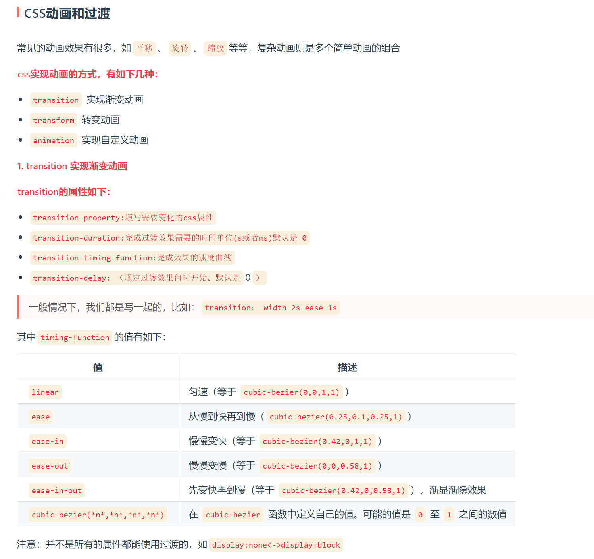

1.塌陷
css中塌陷是什么？是什么原因导致的

在CSS中，"塌陷"通常指的是一些HTML元素的尺寸或布局不如你预期的那样来显示，这可能是由于CSS布局模型和文档流的工作方式导致的。
主要的塌陷问题包括外边距折叠（margin collapsing）和清除浮动（clearing floats）。

- 外边距折叠（Margin Collapsing）： 外边距折叠是指相邻的两个（或更多）块级元素的垂直外边距（margin）会合并成一个外边距。
这通常发生在垂直方向上，当一个元素的底外边距和下一个元素的顶外边距相遇时，它们会合并成一个外边距，这可能会导致间距不如预期大。

>原因： 外边距折叠是为了使布局更合理和一致而设计的，但有时会引发问题，特别是在嵌套元素或父子元素之间。

- 清除浮动（Clearing Floats）： 清除浮动是指在包含浮动元素的容器中，当容器没有设置适当的高度来包含浮动元素时，容器的高度会塌陷，
导致容器无法正确地包围浮动元素。

>原因： 这是因为浮动元素脱离了正常文档流，容器不会自动调整其高度以适应浮动元素的高度。为了解决这个问题，
通常需要使用CSS清除浮动的技巧，例如添加clear属性或使用伪元素。

这些塌陷问题通常可以通过适当的CSS样式和布局技巧来解决，以确保元素按照预期的方式呈现和定位。
外边距折叠和清除浮动是CSS布局中常见的挑战，但在理解它们的工作原理并采取适当的措施时，可以有效地处理它们。

2. 选择器权重计算方式
>!import > 内联样式=外联样式 > ID选择器 > 类选择器 = 伪类选择器 = 属性选择器 > 元素选择器 = 伪元素选择器>通配选择器
-属性后面加!important会覆盖页面内任何位置定义的元素样式
-作为style属性写在元素内的样式
-id选择器
-类选择器
-标签选择器
-通配符选择器（*）
-浏览器自定义或继承
> 同一级别：后写的会覆盖先写的
> css选择器的解析原则：选择器定位DOM元素是从右往左的方向，这样可以尽早的过滤掉一些不必要的样式规则和元素

3.居中布局
-内联居中布局
 -水平居中
  -行内元素可设置：text-align: center
  -flex布局设置父元素：display: flex; justify-content: center
 -垂直居中
  -单行文本父元素确认高度：height === line-height
  -多行文本父元素确认高度：display: table-cell; vertical-align: middle
-块级居中布局
 -水平居中
  -定宽: margin: 0 auto
  -绝对定位+left:50%+margin:负自身一半
 -垂直居中
  -position: absolute设置left、top、margin-left、margin-top(定高)
  -display: table-cell
  -transform: translate(x, y)
  -flex(不定高，不定宽)
  -grid(不定高，不定宽)，兼容性相对比较差

4.css3新特性
-边框
 -border-radius：创建圆角边框
 -box-shadow：为元素添加阴影
 -border-image：使用图片来绘制边框
-transition
    -transition： CSS属性，花费时间，效果曲线(默认ease)，延迟时间(默认0) ===transition-property: width;
        transition-duration: 1s;
        transition-timing-function: linear;
        transition-delay: 2s;
-transform转换
    -transform属性允许你旋转，缩放，倾斜或平移给定元素
    -transform-origin：转换元素的位置（围绕那个点进行转换），默认值为(x,y,z):(50%,50%,0)
    -使用方式：
    
     -transform: translate(120px, 50%)：位移
     -transform: scale(2, 0.5)：缩放
     -transform: rotate(0.5turn)：旋转
     -transform: skew(30deg, 20deg)：倾斜
-animation 动画
动画这个平常用的也很多，主要是做一个预设的动画。和一些页面交互的动画效果，结果和过渡应该一样，让页面不会那么生硬。animation也有很多的属性

    -animation-name：动画名称
    -animation-duration：动画持续时间
    -animation-timing-function：动画时间函数
    -animation-delay：动画延迟时间
    -animation-iteration-count：动画执行次数，可以设置为一个整数，也可以设置为infinite，意思是无限循环
    -animation-direction：动画执行方向
    -animation-paly-state：动画播放状态
    -animation-fill-mode：动画填充模式
transition和animation的区别
>Animation和transition大部分属性是相同的，他们都是随时间改变元素的属性值，他们的主要区别是transition需要触发一个事件才能改变属性，
> 而animation不需要触发任何事件的情况下才会随时间改变属性值，并且transition为2帧，从from .... to，而animation可以一帧一帧的

更多动画内容见：https://interview.poetries.top/docs/base/high-frequency.html#css%E5%8A%A8%E7%94%BB%E5%92%8C%E8%BF%87%E6%B8%A1